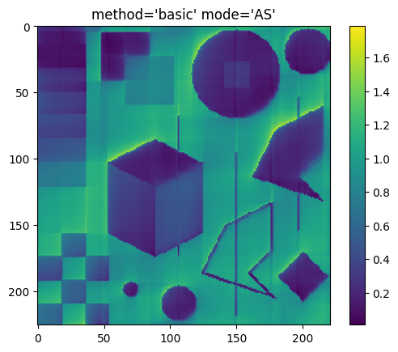

# Python library : torch_hilbert

2D Hilbert Transformations on PyTorch - Code example based on research article


# Infos :

This example of Python code is the implementation of the article below.

# Reference :

Lorenzo-Ginori, Juan. (2007). An Approach to the 2D Hilbert Transform for Image Processing Applications. Lecture Notes in Computer Science. 157-165. 10.1007/978-3-540-74260-9_14.

https://www.researchgate.net/publication/221472037_An_Approach_to_the_2D_Hilbert_Transform_for_Image_Processing_Applications


<hr />


# Install library


```bash
%%bash
if !python -c "import torch_hilbert" 2>/dev/null; then
    pip install https://github.com/Simon-Bertrand/2DHilbertTransformations-PyTorch/archive/main.zip
fi
```

# Import library


```python
!pip install .
import torch_hilbert
```

    Processing /home/sbertrand/Développement/repos/gits/torch-modules/torch_hilbert
      Installing build dependencies ... [?25ldone
    [?25h  Getting requirements to build wheel ... [?25ldone
    [?25h  Installing backend dependencies ... [?25ldone
    [?25h  Preparing metadata (pyproject.toml) ... [?25ldone
    [?25hRequirement already satisfied: torch>=2.2.1 in /home/sbertrand/Développement/repos/gits/torch-modules/.venv/lib/python3.10/site-packages (from torch_hilbert==0.0.1) (2.2.2)
    Requirement already satisfied: numpy==1.26.4 in /home/sbertrand/Développement/repos/gits/torch-modules/.venv/lib/python3.10/site-packages (from torch_hilbert==0.0.1) (1.26.4)
    Requirement already satisfied: filelock in /home/sbertrand/Développement/repos/gits/torch-modules/.venv/lib/python3.10/site-packages (from torch>=2.2.1->torch_hilbert==0.0.1) (3.13.3)
    Requirement already satisfied: typing-extensions>=4.8.0 in /home/sbertrand/Développement/repos/gits/torch-modules/.venv/lib/python3.10/site-packages (from torch>=2.2.1->torch_hilbert==0.0.1) (4.10.0)
    Requirement already satisfied: sympy in /home/sbertrand/Développement/repos/gits/torch-modules/.venv/lib/python3.10/site-packages (from torch>=2.2.1->torch_hilbert==0.0.1) (1.12)
    Requirement already satisfied: networkx in /home/sbertrand/Développement/repos/gits/torch-modules/.venv/lib/python3.10/site-packages (from torch>=2.2.1->torch_hilbert==0.0.1) (3.2.1)
    Requirement already satisfied: jinja2 in /home/sbertrand/Développement/repos/gits/torch-modules/.venv/lib/python3.10/site-packages (from torch>=2.2.1->torch_hilbert==0.0.1) (3.1.3)
    Requirement already satisfied: fsspec in /home/sbertrand/Développement/repos/gits/torch-modules/.venv/lib/python3.10/site-packages (from torch>=2.2.1->torch_hilbert==0.0.1) (2024.3.1)
    Requirement already satisfied: nvidia-cuda-nvrtc-cu12==12.1.105 in /home/sbertrand/Développement/repos/gits/torch-modules/.venv/lib/python3.10/site-packages (from torch>=2.2.1->torch_hilbert==0.0.1) (12.1.105)
    Requirement already satisfied: nvidia-cuda-runtime-cu12==12.1.105 in /home/sbertrand/Développement/repos/gits/torch-modules/.venv/lib/python3.10/site-packages (from torch>=2.2.1->torch_hilbert==0.0.1) (12.1.105)
    Requirement already satisfied: nvidia-cuda-cupti-cu12==12.1.105 in /home/sbertrand/Développement/repos/gits/torch-modules/.venv/lib/python3.10/site-packages (from torch>=2.2.1->torch_hilbert==0.0.1) (12.1.105)
    Requirement already satisfied: nvidia-cudnn-cu12==8.9.2.26 in /home/sbertrand/Développement/repos/gits/torch-modules/.venv/lib/python3.10/site-packages (from torch>=2.2.1->torch_hilbert==0.0.1) (8.9.2.26)
    Requirement already satisfied: nvidia-cublas-cu12==12.1.3.1 in /home/sbertrand/Développement/repos/gits/torch-modules/.venv/lib/python3.10/site-packages (from torch>=2.2.1->torch_hilbert==0.0.1) (12.1.3.1)
    Requirement already satisfied: nvidia-cufft-cu12==11.0.2.54 in /home/sbertrand/Développement/repos/gits/torch-modules/.venv/lib/python3.10/site-packages (from torch>=2.2.1->torch_hilbert==0.0.1) (11.0.2.54)
    Requirement already satisfied: nvidia-curand-cu12==10.3.2.106 in /home/sbertrand/Développement/repos/gits/torch-modules/.venv/lib/python3.10/site-packages (from torch>=2.2.1->torch_hilbert==0.0.1) (10.3.2.106)
    Requirement already satisfied: nvidia-cusolver-cu12==11.4.5.107 in /home/sbertrand/Développement/repos/gits/torch-modules/.venv/lib/python3.10/site-packages (from torch>=2.2.1->torch_hilbert==0.0.1) (11.4.5.107)
    Requirement already satisfied: nvidia-cusparse-cu12==12.1.0.106 in /home/sbertrand/Développement/repos/gits/torch-modules/.venv/lib/python3.10/site-packages (from torch>=2.2.1->torch_hilbert==0.0.1) (12.1.0.106)
    Requirement already satisfied: nvidia-nccl-cu12==2.19.3 in /home/sbertrand/Développement/repos/gits/torch-modules/.venv/lib/python3.10/site-packages (from torch>=2.2.1->torch_hilbert==0.0.1) (2.19.3)
    Requirement already satisfied: nvidia-nvtx-cu12==12.1.105 in /home/sbertrand/Développement/repos/gits/torch-modules/.venv/lib/python3.10/site-packages (from torch>=2.2.1->torch_hilbert==0.0.1) (12.1.105)
    Requirement already satisfied: triton==2.2.0 in /home/sbertrand/Développement/repos/gits/torch-modules/.venv/lib/python3.10/site-packages (from torch>=2.2.1->torch_hilbert==0.0.1) (2.2.0)
    Requirement already satisfied: nvidia-nvjitlink-cu12 in /home/sbertrand/Développement/repos/gits/torch-modules/.venv/lib/python3.10/site-packages (from nvidia-cusolver-cu12==11.4.5.107->torch>=2.2.1->torch_hilbert==0.0.1) (12.4.99)
    Requirement already satisfied: MarkupSafe>=2.0 in /home/sbertrand/Développement/repos/gits/torch-modules/.venv/lib/python3.10/site-packages (from jinja2->torch>=2.2.1->torch_hilbert==0.0.1) (2.1.5)
    Requirement already satisfied: mpmath>=0.19 in /home/sbertrand/Développement/repos/gits/torch-modules/.venv/lib/python3.10/site-packages (from sympy->torch>=2.2.1->torch_hilbert==0.0.1) (1.3.0)
    Building wheels for collected packages: torch_hilbert
      Building wheel for torch_hilbert (pyproject.toml) ... [?25ldone
    [?25h  Created wheel for torch_hilbert: filename=torch_hilbert-0.0.1-py3-none-any.whl size=13929 sha256=3a879231c330784a36ba1a7356d6740fbb6f1136331bc70c27b5164a128efa98
      Stored in directory: /tmp/pip-ephem-wheel-cache-dpbc1jxc/wheels/14/ab/82/da9087665506dc6cf3079464827d5d5607323bc5fd9dca4f6e
    Successfully built torch_hilbert
    Installing collected packages: torch_hilbert
      Attempting uninstall: torch_hilbert
        Found existing installation: torch_hilbert 0.0.1
        Uninstalling torch_hilbert-0.0.1:
          Successfully uninstalled torch_hilbert-0.0.1
    Successfully installed torch_hilbert-0.0.1
    
    [notice] A new release of pip is available: 23.2.1 -> 24.0
    [notice] To update, run: pip install --upgrade pip


# Load data


```python
!pip install -q torchvision requests matplotlib
import torchvision
import torch.nn.functional as F
import torch
im = torchvision.io.read_image("./imgs/example.png", torchvision.io.ImageReadMode.GRAY).divide(255)

```

    
    [notice] A new release of pip is available: 23.2.1 -> 24.0
    [notice] To update, run: pip install --upgrade pip


# Compute Hilbert transformations


```python
import torch_hilbert
import matplotlib.pyplot as plt


for mode in ["AS", "HT"]:
    for method in ["basic", "combined", "single_orthant", "directional"]:

        plt.imshow(
            torch_hilbert.HilbertTransformations(method, mode)(im)
            .abs()
            .moveaxis(0, -1)
        )
        plt.title(f"{method=} {mode=}")
        plt.colorbar()
        plt.show()
```


    

    


    

    


    

    


    

    


    

    


    

    


    

    


    

    

